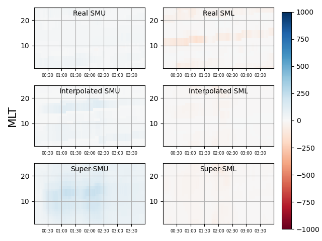
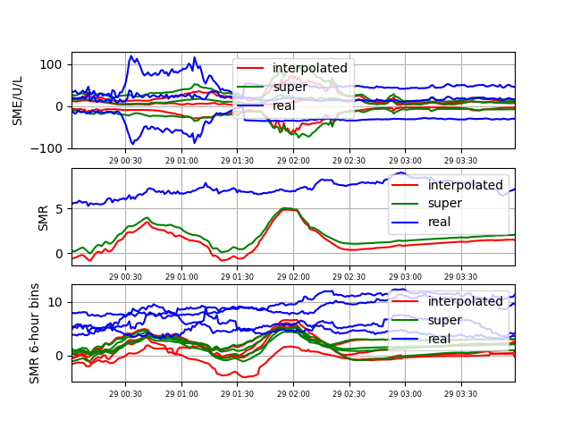

SuperMAG: Ground Magnetometer Measurements
==========================================

Introduction
------------

Comparison of magnetosphere model results to ground magnetometer measurements
is a common technique for validating simulations. In the MAGE software, the
program ``calcdb.x`` is used to calculate magnetic field perturbations on a
grid on the Earth's surface using the
`Biot-Savart Law <https://en.wikipedia.org/wiki/Biot%E2%80%93Savart_law>`_,
and the ionospheric, field-aligned, and magnetospheric current systems
extracted from the MAGE simulation results.

This page provides an overview of how to perform these calculations using
results from a MAGE simulation. The :doc:`superMAGE` page provides
instructions for performing more detailed comparisons between these model
results and data obtained from the `SuperMAG <https://supermag.jhuapl.edu/>`_
collection of ground magnetometer data.

A simple example
----------------

The program ``calcdb.x`` requires an XML file as input. The XML file provides
details on the MAGE simulation results to be used in the calculation of the
ground magnetic field perturbations, and the output requirements for the
calculation. This XML file is passed to the ``calcdb.x`` program as a
command-line argument.

Assume we have completed a simulation of the magnetosphere using the MPI
version of the MAGE code. The run ID is ``geospace``. A 4x4x1 MPI
decomposition was used. All results are in the current directory. The
simulation results are in the HDF5 files ``geospace_*.gam.h5``. We want to
compute the ground magnetic field perturbations corresponding to this model
output. Use the following specifications for the calculation:

* Start the computation at 0 simulated seconds after the start of the
  simulation results, and end at 14400 simulated seconds (4 simulated hours)
  after the start of the simulation results, and provide ground magnetic field
  perturbation values at an interval of 60 simulated seconds (1 simulated
  minute).

* The spatial grid on the ground will have 360 latitude bins and 720 longitude
  bins (0.5 x 0.5 degree/grid cell).

Here is a sample XML input file that implements these requirements.

.. code-block:: XML

    <?xml version="1.0"?>
    <Kaiju>
        <Chimp>
            <sim runid="geospace"/>
            <time T0="0.0" dt="60.0" tFin="14400.0"/>
            <fields ebfile="geospace" grType="LFM" doJ="T" isMPI="true"/>
            <parallel Ri="4" Rj="4" Rk="1"/>
            <grid Nlat="360" Nlon="720" Nz="1"/>
        </Chimp>
    </Kaiju>

These XML elements and their attributes are described below. Note that *all*
XML attribute values are entered as strings, in ``"double quotes"``. Defaults
are supplied in ``calcdb.x`` for all values not set in the XML file, so
technically this file is optional. In practice, you will want to create your
own input XML file for ``calcdb.x``, since the defaults for items like
``ebfile`` are not usually appropriate for a user run.

Once created, this XML file (``calcdb-geospace.xml``) can be used to run the
ground magnetic field perturbation computation as follows:

.. code-block:: bash

    calcdb.x calcdb-geospace.xml >& calcdb-geospace.out

Making the calculation go faster
--------------------------------

The computation can take a long time, so submitting this computation as a PBS
job array can be more time-efficient, by taking advantage of parallel
execution. To split the work of ``calcdb.x`` into 4 equally-sized batches, an
additional line is needed in the XML file:

.. code-block:: XML

    <?xml version="1.0"?>
    <Kaiju>
        <Chimp>
            <sim runid="geospace"/>
            <time T0="0.0" dt="60.0" tFin="14400.0"/>
            <fields ebfile="geospace" grType="LFM" doJ="T" isMPI="true"/>
            <parallel Ri="4" Rj="4" Rk="1"/>
            <grid Nlat="360" Nlon="720" Nz="1"/>
            <parintime NumB="4"/>
        </Chimp>
    </Kaiju>

The associated PBS script should look something like this (actual modules and
paths will be different for your installation):

.. code-block:: bash

    #!/bin/bash

    # This script runs calcdb.x to compute ground delta-B values from the
    # results of a MAGE simulation.

    # This script was generated to run on derecho.

    #PBS -N calcdb-geospace
    #PBS -A YOUR_ACCOUNT_HERE
    #PBS -q main
    #PBS -l job_priority=economy
    #PBS -l select=1:ncpus=128:ompthreads=128
    #PBS -l walltime=01:00:00
    #PBS -j oe
    #PBS -m abe

    echo "Job ${PBS_JOBID} started at `date` on `hostname` in directory `pwd`."

    source $HOME/.bashrc

    echo 'Loading modules.'
    module --force purge
    module load ncarenv/23.06
    module load craype/2.7.20
    module load intel/2023.0.0
    module load ncarcompilers/1.0.0
    module load cray-mpich/8.1.25
    module load hdf5-mpi/1.12.2
    echo 'The currently loaded modules are:'
    module list

    echo 'Loading python environment.'
    conda activate YOUR_CONDA_ENVIRONMENT
    echo "The current conda environment is ${CONDA_PREFIX}."

    echo 'Setting up kaipy environment.'
    source YOUR_KAIPY_PATH/kaipy/scripts/setupEnvironment.sh
    echo "The kaipy software is located at ${KAIPYHOME}."

    echo 'Setting up MAGE environment.'
    source YOUR_KAIJU_PATH/scripts/setupEnvironment.sh
    echo "The kaiju software is located at ${KAIJUHOME}."

    echo 'Setting environment variables.'
    export OMP_NUM_THREADS=128
    export KMP_STACKSIZE=128M
    export JNUM=${PBS_ARRAY_INDEX:-0}
    echo 'The active environment variables are:'
    printenv

    # Compute the ground delta B values.
    log_file="calcdb.out.${JNUM}"
    cmd="./calcdb.x calcdb-geospace.xml ${JNUM} >& ${log_file}"
    echo "calcdb.x run command is:"
    echo $cmd
    eval $cmd

    echo "Job ${PBS_JOBID} ended at `date` on `hostname` in directory `pwd`."

This job array can be submitted with the command

.. code-block:: bash

    qsub -J 1-4 calcdb-geospace.pbs

The ``-J 1-4`` arguments indicates that a PBS *job array* will be used. Note
that the value of the ``-J`` option must be ``1-NumB``, where ``NumB`` must
match the value of the ``NumB`` attribute of the ``<parintime/>`` element from
the XML file. When this job array completes, the result directory will contain
files of the form ``calcdb.out.#`` which will contain the terminal output from
``calcdb.x`` during the run for each batch ``#`` in the job array.

After your job array completes, you'll need to do one more step before you can
use your results. The parallel processing results in multiple output HDF5
files (``geospace.0001.deltab.h5``, ``geospace.0002.deltab.h5``, ...). The
script ``$KAIPYHOME/kaipy/scripts/postproc/pitmerge.py`` will concatenate the
individual HDF5 files into one file called ``geospace.deltab.h5``.

.. code-block:: bash

    $KAIPYHOME/kaipy/scripts/postproc/pitmerge.py -runid geospace

You can now use ``geospace.deltab.h5`` for your analysis.

XML file syntax
---------------

The elements and attributes of the XML file are described below.

* ``<?xml version="1.0"?>`` (required): Specifies XML version.

* ``<Kaiju>`` (required): Outer container for other elements.

* ``<Chimp>`` (required): Inner container for other elements.

* ``<sim>`` (optional): Specify identifying information for the MAGE run.

    * ``runid`` (optional, default ``Sim``): String specifying the identifier
      for this run of ``calcdb.x``. A best practice is to use the ``runid`` in
      the name of the XML file.

* ``<time>`` (optional): Specify time range and interval for magnetic field
  calculation.

    * ``T0`` (optional, default ``0.0``): Start time (simulated seconds) for
      ground magnetic field calculation, relative to start of simulation
      results used as input.
    * ``dt`` (optional, default ``1.0``): Time interval and output cadence
      (simulated seconds) for ground magnetic field calculation.
    * ``tFin`` (optional, default ``60.0``): Stop time (simulated seconds) for
      ground magnetic field calculation, relative to start of simulation
      results used as input.

* ``<fields>`` (required): Describes the MAGE model results to use.

    * ``ebfile`` (optional, default ``ebdata``): Root name for HDF5 files
      containing the results produced by a MAGE model run.
    * ``grType`` (optional, default ``EGG``): String specifying grid type used
      by the MAGE output file. Valid values are ``EGG``, ``LFM``, ``SPH``. If
      the string is not one of the supported grid types, the default value
      (``EGG``) is used, and a warning message is printed.
    * ``doJ`` (required, must be ``T``): If ``T``, compute currents from the
      MAGE model results.
    * ``isMPI`` (optional): If ``true``, the MAGE results are from an MPI run.
    * ``doEBFix`` (optional, default ``false``): Set to ``true`` to "clean"
      the electric field E so that the dot product of the electric and
      magnetic fields is 0.
    * ``doMHD`` (optional, default ``false``): Set to ``true`` to pass the
      full set of magnetohydrodynamic variables to CHIMP, rather than just
      electric and magnetic fields..

* ``<parallel>`` (required): Describes the MPI decomposition of MAGE model
  run.

    * ``Ri`` (optional, default ``1``): Number of ranks used in MPI
      decomposition  of ``i`` dimension.
    * ``Rj`` (optional, default ``1``): Number of ranks used in MPI
      decomposition  of ``j`` dimension.
    * ``Rk`` (optional, default ``1``): Number of ranks used in MPI
      decomposition of ``k`` dimension.
    * ``doOldNaming`` (optional, default ``false``): Allow for backward
      compatibility for MHD files generated with the now deprecated naming
      convention.

* ``<parintime>`` (optional): Options to run a PBS job array of ``calcdb.x``
  to increase calculation speed.

    * ``NumB`` (optional, default ``0``): Number of batches into which the
      calculation will be split for parallel computation. Must equal the job
      array size ``NumB`` used in ``-J 1-NumB`` on the ``qsub`` command line.

* ``<grid>`` (optional): Options to specify the grid on the ground used in
  ``calcdb.x``.

    * ``doH5g`` (optional, default ``false``):  Set to ``true`` to use a grid
      specified in an external HDF5 file, specified by ``H5Grid``. If
      ``false``, will use a Cartesian grid in latitude, longitude, and
      altitude specified by ``Nlat``, ``Nlon``, and ``Nz``
    * ``H5Grid`` (optional, default ``grid.h5``): String specifying an the
      name of the HDF5 file where the grid is specified. Used if
      ``doH5g="true"``.
    * ``Nlat`` (optional, default ``45``): Number of latitude cells.
    * ``Nlon`` (optional, default ``90``): Number of longitude cells.
    * ``Nz`` (optional, default ``2``): Number of altitude cells.
    * ``doGEO`` (optional, default ``false``):  Set to ``true`` to use the
      geographic coordinate system on the ground. If set to ``false``, will
      use the SM coordinate system used in magnetosphere runs.
    * ``dzGG`` (optional, default ``10.0``):  Height spacing (kilometers) of
      grid.
    * ``z0`` (optional, default ``0.0``):  Starting height above ground
      (kilometers) for grid calculation.

* ``<calcdb>`` (optional): Optional settings for ``calcdb.x``.

    * ``rMax`` (optional, default ``30``): Radius (as a multiple of the Earth
      radius) to perform integration over.
    * ``doCorot`` (optional, default ``false``):  Set to ``true`` to use the
      corotation potential in the calculation.
    * ``doHall`` (optional, default ``true``):  Set to ``true`` to include
      Hall currents in calculation.
    * ``doPed`` (optional, default ``true``):  Set to ``true`` to include
      Pedersen currents in calculation.

* ``<interp>`` (optional): Options related to interpolation.

  * ``wgt`` (optional, default ``TSC``): Sets 1D interpolation type. Valid
    values are ``TSC`` (1D triangular shaped cloud), ``LIN`` (linear),
    ``QUAD`` (parabolic).

* ``<output>`` (optional): Options related to ``calcdb.x`` output.

    * ``dtOut`` (optional, default ``10.0``): Output cadence (simulated
      seconds).
    * ``timer`` (optional, default ``false``): Set to ``true`` to turn time
      flags on.
    * ``tsOut`` (optional, default ``10``): Cadence to output diagnostics to
      run log file.
    * ``doFat`` (optional, default ``false``): Set to ``true`` to include
      spherical vector components of magnetic field perturbations and
      currents.

* ``<units>`` (optional): Describe units system used in the model run.

    * ``uID`` (optional, default ``Earth``): Valid values (case-insensitive)
      are ``EARTH``, ``EARTHCODE``, ``JUPITER``, ``JUPITERCODE``, ``SATURN``,
      ``SATURNCODE``, ``HELIO"``, ``LFM``, ``LFMJUPITER``.

Plotting the ground magnetic field perturbations
------------------------------------------------

Once you have your results in a single file, such as ``geospace.deltab.h5``,
you can plot the results. A script (``supermag_comparison.py``) has been
provided as part of the ``kaipy`` package to make standard plots of delta-B
results and compare them to data in the SuperMAG database.

.. code-block:: bash

    usage: supermag_comparison.py [-h] [--debug] [--smuser SMUSER] [--verbose] calcdb_results_path

    Create MAGE-SuperMag comparison plots.

    positional arguments:
      calcdb_results_path  Path to a (possibly merged) result file from calcdb.x.

    optional arguments:
      -h, --help           show this help message and exit
      --debug, -d          Print debugging output (default: False).
      --smuser SMUSER      SuperMag user ID to use for SuperMag queries (default: ).
      --verbose, -v        Print verbose output (default: False).

As an example, assuming your delta-B results are in the current directory as
``geospace.deltab.h5``, you can generate the standard plots with the command:

.. code-block:: bash

    $KAIPYHOME/kaipy/scripts/postproc/supermag_comparison.py --verbose --smuser=ewinter /PATH/TO/geospace.deltab.h5

The ``smuser`` argument is the name of the account (which must already exist)
that you use to fetch data from SuperMAG. Note also that the local SuperMAG
cache directory (usually ``$HOME/supermag``) must already exist. You should
find in your current directory a pair of plots (``contours.png`` and
``indices.png``) that compare various computed and measured geomagnetic
indices. Sample plots are provided below.

``contours.png``

``indices.png``

Putting it all together
-----------------------

The ``kaipy`` distribution provides a wrapper script
(``$KAIPYHOME/kaipy/scripts/postproc/run_ground_deltaB_analysis.py``) which
encapsulates all of these steps, including splitting the calculation across
multiple PBS jobs.

.. code-block:: bash

    usage: run_ground_deltaB_analysis.py [-h] [--calcdb CALCDB] [--debug] [--dt DT] [--hpc {derecho,pleiades}] [--parintime PARINTIME] [--pbs_account PBS_ACCOUNT] [--smuser SMUSER] [--verbose] mage_results_path

    Compare MAGE ground delta-B to SuperMag measurements, and create SuperMAGE analysis maps.

    positional arguments:
      mage_results_path     Path to a result file for a MAGE magnetosphere run.

    optional arguments:
      -h, --help            show this help message and exit
      --calcdb CALCDB       Path to calcdb.x binary (default: calcdb.x).
      --debug, -d           Print debugging output (default: False).
      --dt DT               Time interval for delta-B computation (seconds) (default: 60.0).
      --hpc {derecho,pleiades}
                            HPC system to run analysis (default: pleiades).
      --parintime PARINTIME
                            Split the calculation into this many parallel chunks of MAGE simulation steps, one chunk per node (default: 1).
      --pbs_account PBS_ACCOUNT
                            PBS account to use for job accounting (default: None).
      --smuser SMUSER       Account name for SuperMag database access (default: None).
      --verbose, -v         Print verbose output (default: False).

This script generates a set of PBS scripts which perform each stage of the
process:

* Running ``calcdb.x`` to compute ground delta-B values.
* Running ``pitmerge.py`` if needed to combine results.
* Running ``supermag_comparison.py`` to generate the plots.

A ``bash`` script (``submit-RUNID.sh``) is also created which can be run to
submit all of the PBS jobs with the proper dependencies. Continuing the
earlier example, this wrapper script can be run in your MAGE result directory
on ``derecho`` with the command:

.. code-block:: bash

    run_ground_deltaB_analysis.py --calcdb=/PATH/TO/calcdb.x --dt=60.0 --hpc=derecho --parintime=4 --pbs_account=YOUR_DERECHO_ACCOUNT --smuser=YOUR_SUPERMAG_ACCOUNT --verbose /PATH/TO_MAGE_HDF5_FILE

For the runid of ``geospace`` used in the above examples, your MAGE output
directory will now contain several new files:

.. code-block:: bash

    calcdb-geospace.pbs
    calcdb-geospace.xml
    ground_deltab_analysis-geospace.pbs
    pitmerge-geospace.pbs
    submit-geospace.sh

To submit all of the PBS jobs to perform all steps in the analysis, just run
the ``bash`` script:

.. code-block:: bash

    bash submit-geospace.sh

If desired, the individual PBS scripts can be run manually. They have been
design (as much as possible) to be runnable as either PBS job scripts or
standard ``bash`` shell scripts. For example, to run the ``calcdb.x`` job
array on ``derecho``, followed by merging and plot generation on ``casper``
you could use the commands:

.. code-block:: bash

    # On derecho
    qsub -J 1-4 calcdb-geospace.pbs

    # On casper (edit PBS scripts appropriately)
    qsub pitmerge-geospace.pbs
    qsub ground_deltab_analysis-geospace.pbs

A similar procedure can be used if you wish to perform the merge and plotting
steps on a non-HPC system, such as your laptop. In that case, slight
system-dependent modifications to the individual PBS scripts may be required.
