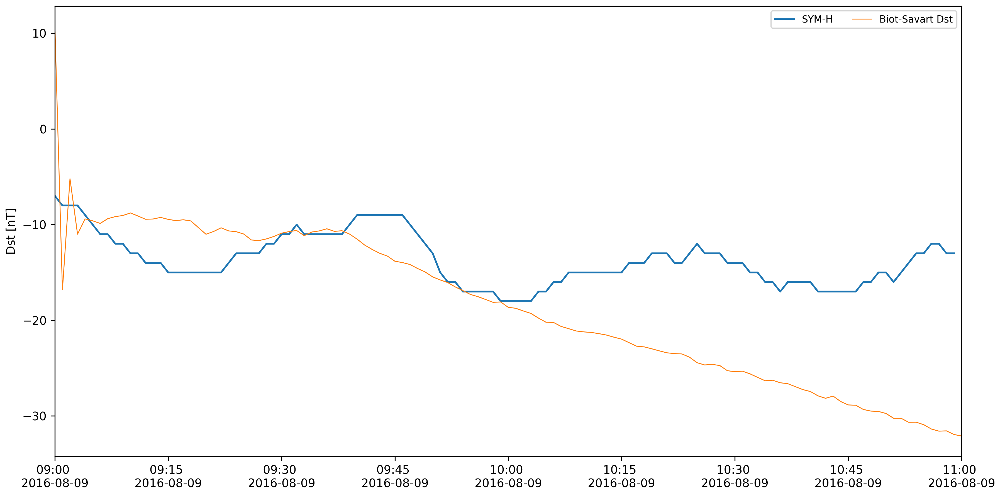
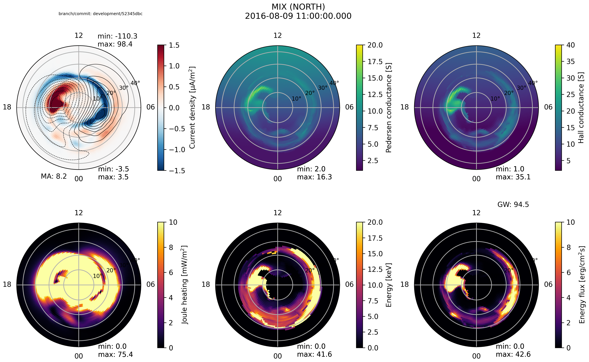
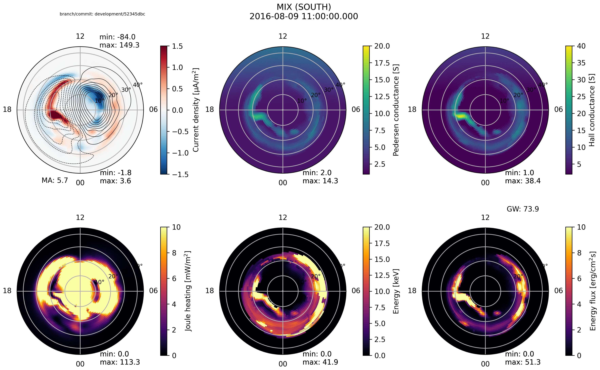
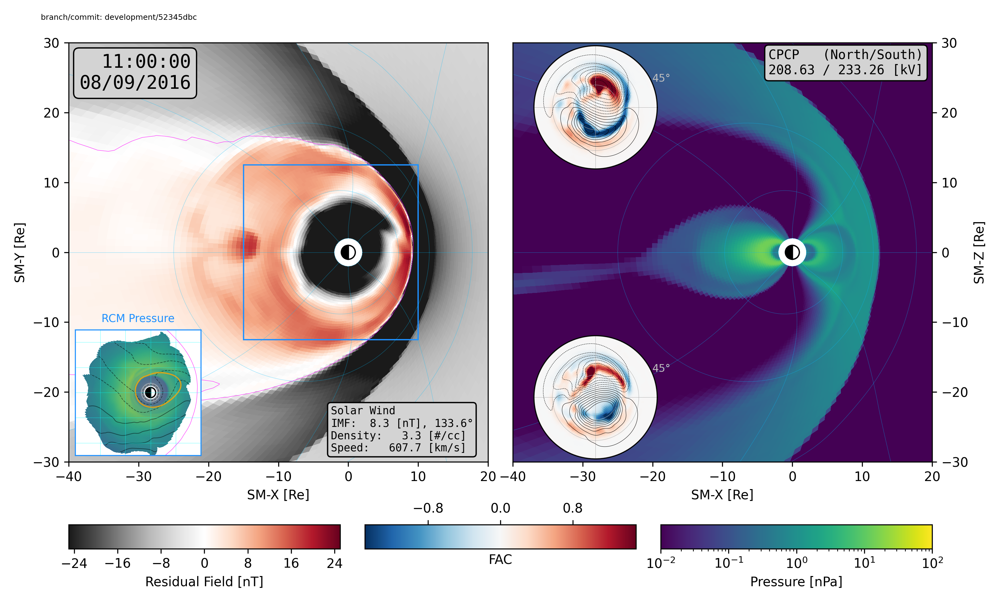
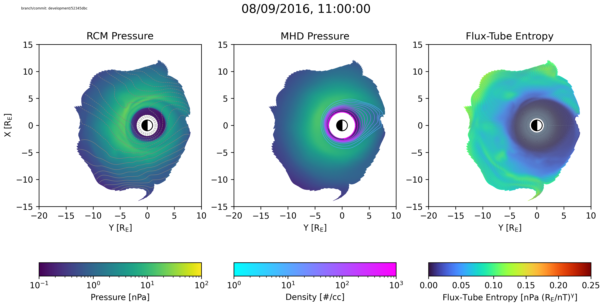

Quick-look plots for model results
==================================

.. ``dbpic.py``
.. ----------------

.. This script visualizes output from the program ``calcdb.x``\ , which computes
.. ground magnetometer readings (delta B) corresponding to a ``gamera``
.. terrestrial magnetosphere run. The script is found at:

.. .. code-block::

..    KAIJUHOME/scripts/quicklook/dbpic.py

.. Help text for the script can be found using the ``--help`` command-line option:

.. .. code-block::

..    usage: dbpic.py [-h] [--debug] [-d directory] [-n step] [-id runid] [-Jr] [-k0 layer] [--spacecraft spacecraft] [-v]

..    Plot the ground magnetic field perturbations for a MAGE magnetosphere run.

..    optional arguments:
..      -h, --help            show this help message and exit
..      --debug               Print debugging output (default: False).
..      -d directory          Directory containing data to read (default: /glade/derecho/scratch/ewinter/cgs/runs/test/makeitso)
..      -n step               Time slice to plot (default: -1)
..      -id runid             Run ID of data (default: msphere)
..      -Jr                   Show radial component of anomalous current (default: False).
..      -k0 layer             Vertical layer to plot (default: 0)
..      --spacecraft spacecraft
..                            Names of spacecraft to plot magnetic footprints, separated by commas (default: None)
..      -v, --verbose         Print verbose output (default: False).

.. As an example, running ``dbpic.py`` on the output generated by the magnetosphere quickstart case generates the following file (``qkdbpic.png``):

.. .. image:: https://bitbucket.org/repo/kMoBzBp/images/1367296445-qkdbpic.png
..    :target: https://bitbucket.org/repo/kMoBzBp/images/1367296445-qkdbpic.png
..    :alt: qkdbpic.png

``dstpic.py``
-------------

This script visualizes Dst output from gamera-RCM. Help text for the script
can be displayed using the ``--help`` command-line option:

.. code-block:: bash

   $ dstpic.py --help
   usage: dstpic.py [-h] [-d directory] [-id runid] [-tpad time padding] [-swfile filename] [--dps]

   Creates simple plot comparing SYM-H from OMNI dataset to Gamera-RCM.
      Need to run or point to directory that has the bcwind and msphere.gam
      files of interest.  Note this calculation only includes the
      magnetospheric currents and does not include the ionospheric currents or
      the FACS.  It should be used with CAUTION and never in a scientific
      publication.

  optional arguments:
    -h, --help          show this help message and exit
    -d directory        Directory to read from (default: /glade/derecho/scratch/ewinter/cgs/runs/test/makeitso)
    -id runid           RunID of data (default: msphere)
    -tpad time padding  Time beyond MHD data (in hours) to plot (default: 8)
    -swfile filename    Solar wind file name (default: bcwind.h5)
    --dps               Also plot the DPS Dst (default: False)

As an example, running ``dstpic.py`` on the output generated by the standard
magnetosphere quickstart case generates the following file (``qkdstpic.png``):

.. ``heliopic.py``
.. -------------------

.. This script visualizes results from ``gamhelio.x``. The script is found at:

.. .. code-block::

..    KAIJUHOME/scripts/quicklook/heliopic.py

.. Help text for the script can be found using the ``-h`` command-line option:

.. .. code-block::

..    usage: heliopic.py [-h] [-d directory] [-id runid] [-n step] [-den] [-nompi]
..                       [-p pictype]

..    Creates simple multi-panel figure for Gamera helio run
..        Top Panel - density and radial velocity in equatorial plane
..        Bottom Panel - density and radial velocity in meridional plane

..    optional arguments:
..      -h, --help    show this help message and exit
..      -d directory  Directory to read from (default: /Users/winteel1)
..      -id runid     RunID of data (default: wsa)
..      -n step       Time slice to plot (default: -1)
..      -den          Show density instead of pressure (default: False)
..      -nompi        Don't show MPI boundaries (default: False)
..      -p pictype    Type of output image (default: pic1)

.. As an example, running ``heliopic.py`` on the output generated by the standard
.. ``helio_mpi`` quickstart case generates the following file
.. (``qkheliopic.png``) (NOTE: Image is large, so it has been reduced in size for
.. use on the wiki):

.. .. image:: https://bitbucket.org/repo/kMoBzBp/images/2600792652-qkpichelio_reduced.png
..    :target: https://bitbucket.org/repo/kMoBzBp/images/2600792652-qkpichelio_reduced.png
..    :alt: qkpichelio_reduced.png

``mixpic.py``
-------------

This script visualizes results from REMIX in a magnetosphere run. Help text for
the script can be displayed using the ``--help`` command-line option:

.. code-block:: bash

   $ mixpic.py --help
   usage: mixpic.py [-h] [--debug] [-id runid] [-n step] [-nflux] [-print] [--spacecraft spacecraft] [-v] [-GTYPE] [-PP] [-vid] [-overwrite]
                  [--ncpus ncpus] [-nohash] [--coord coord]

   Creates simple multi-panel REMIX figure for a GAMERA magnetosphere run.
   Top Row - FAC (with potential contours overplotted), Pedersen and Hall Conductances
   Bottom Row - Joule heating rate, particle energy and energy flux

   optional arguments:
     -h, --help            show this help message and exit
     --debug               Print debugging output (default: False).
     -id runid             Run ID of data (default: msphere)
     -n step               Time slice to plot (default: -1)
     -nflux                Show number flux instead of energy flux (default: False)
     -print                Print list of all steps and time labels, then exit (default: False)
     --spacecraft spacecraft
                             Names of spacecraft to plot magnetic footprints, separated by commas (default: None)
     -v, --verbose         Print verbose output (default: False).
     -GTYPE                Show RCM grid type in the eflx plot (default: False)
     -PP                   Show plasmapause (10/cc) in the eflx/nflx plot (default: False)
     -vid                  Make a video and store in mixVid directory (default: False)
     -overwrite            Overwrite existing vid files (default: False)
     --ncpus ncpus         Number of threads to use with --vid (default: 1)
     -nohash               Don't display branch/hash info (default: False)
     --coord coord         Coordinate system to use (default: SM)

As an example, running ``mixpic.py`` on the output generated by the standard
magnetosphere quickstart case generates the following files (``remix_n.png``,
``remix_s.png``).

``msphpic.py``
--------------

This script visualizes results from GAMERA in a magnetosphere run. Help text
for the script can be displayed using the ``--help`` command-line option:

.. code-block:: bash

   $ msphpic.py --help
   /glade/u/home/ewinter/miniconda3/envs/kaiju-3.8/lib/python3.8/site-packages/spacepy/time.py:2367: UserWarning: Leapseconds may be out of date. Use spacepy.toolbox.update(leapsecs=True)
   warnings.warn('Leapseconds may be out of date.'
   usage: msphpic.py [-h] [--debug] [-d directory] [-id runid] [-n step] [-bz] [-den] [-jy] [-ephi] [-noion] [-nompi] [-norcm] [-bigrcm]
                     [-src] [-v] [--spacecraft spacecraft] [-vid] [-overwrite] [--ncpus ncpus] [-nohash]
                     [-size {small,std,big,bigger,fullD,dm}]

   Creates simple multi-panel figure for Gamera magnetosphere run
   Top Panel - Residual vertical magnetic field
   Bottom Panel - Pressure (or density) and hemispherical insets
   NOTE: There is an optional -size argument for domain bounds options
   (default: std), which is passed to kaiViz functions.

   optional arguments:
     -h, --help            show this help message and exit
     --debug               Print debugging output (default: False).
     -d directory          Directory containing data to read (default: /glade/derecho/scratch/ewinter/cgs/runs/test/makeitso)
     -id runid             Run ID of data (default: msphere)
     -n step               Time slice to plot (default: -1)
     -bz                   Show Bz instead of dBz (default: False).
     -den                  Show density instead of pressure (default: False).
     -jy                   Show Jy instead of pressure (default: False).
     -ephi                 Show Ephi instead of pressure (default: False).
     -noion                Don't show ReMIX data (default: False).
     -nompi                Don't show MPI boundaries (default: False).
     -norcm                Don't show RCM data (default: False).
     -bigrcm               Show entire RCM domain (default: False).
     -src                  Show source term (default: False).
     -v, --verbose         Print verbose output (default: False).
     --spacecraft spacecraft
                           Names of spacecraft to plot positions, separated by commas (default: None)
     -vid                  Make a video and store in mixVid directory (default: False)
     -overwrite            Overwrite existing vid files (default: False)
     --ncpus ncpus         Number of threads to use with --vid (default: 1)
     -nohash               Don't display branch/hash info (default: False)
     -size {small,std,big,bigger,fullD,dm}
                           Domain bounds options (default: std)

As an example, running ``msphpic.py`` on the output generated by the standard
magnetosphere quickstart case generates the following file
(``qkmsphpic.png``).

``rcmpic.py``
-------------

This script visualizes results from RCM in a magnetosphere run. Help text
for the script can be displayed using the ``--help`` command-line option:

.. code-block::

   $ rcmpic.py --help
   usage: rcmpic.py [-h] [-beta] [-big] [-bmin] [--debug] [-d directory] [-elec] [-fac] [-id runid] [-kt] [-n step] [--spacecraft spacecraft]
                  [-tbnc] [-v] [-vol] [-wgt] [-vid] [-overwrite] [--ncpus ncpus] [-nohash]

   Creates simple multi-panel figure for RCM magnetosphere run
      Top Panel - XXX
      Bottom Panel - XXX

   optional arguments:
     -h, --help            show this help message and exit
     -beta                 Show beta instead of FTE (default: False)
     -big                  Show entire RCM grid (default: False).
     -bmin                 Show B-min (default: False)
     --debug               Print debugging output (default: False).
     -d directory          Directory containing data to read (default: /glade/derecho/scratch/ewinter/cgs/runs/test/makeitso)
     -elec                 Show electron pressure (default: False)
     -fac                  Show FAC (default: False)
     -id runid             Run ID of data (default: msphere)
     -kt                   Show temperature instead of FTE (default: False)
     -n step               Time slice to plot (default: -1)
     --spacecraft spacecraft
                           Names of spacecraft to plot trajectories, separated by commas (default: None)
     -tbnc                 Show Tb instead of FTE (default: False)
     -v, --verbose         Print verbose output (default: False).
     -vol                  Show FTV instead of FTE (default: False)
     -wgt                  Show wRCM instead of FTE (default: False)
     -vid                  Make a video and store in mixVid directory (default: False)
     -overwrite            Overwrite existing vid files (default: False)
     --ncpus ncpus         Number of threads to use with --vid (default: 1)
     -nohash               Don't display branch/hash info (default: False)

As an example, running ``mixpic.py`` on the output generated by the standard
magnetosphere quickstart case generates the following files (``remix_n.png``,
``remix_s.png``).

.. ``swpic.py``
.. ----------------

.. This script creates a time vs distance plot from a 2D slice created by
.. ``slice.x``. The script is found at:

.. .. code-block::

..    KAIJUHOME/scripts/quicklook/swpic.py

.. Help text for the script can be found using the ``-h`` command-line option:

.. .. code-block::

..    usage: swpic.py [-h] [-d directory] [-id swid] [-type type]

..    Creates simple multi-panel figure for the
..        solar wind conditions within the  bcwind file and saves it as
..        swBCplot.pdf

..    optional arguments:
..      -h, --help    show this help message and exit
..      -d directory  Directory to read from (default: /Users/winteel1)
..      -id swid      Solar wind file used (default: bcwind.h5)
..      -type type    Image type (default: png)

.. As an example, running ``swpic.py`` on the output generated by the standard
.. ``geo_mpi`` quickstart case generates the following file (``bcwind.png``):

.. .. image:: https://bitbucket.org/repo/kMoBzBp/images/360434816-bcwind.png
..    :target: https://bitbucket.org/repo/kMoBzBp/images/360434816-bcwind.png
..    :alt: bcwind.png
