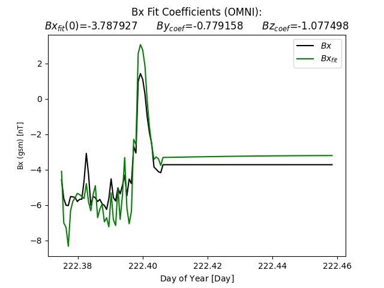
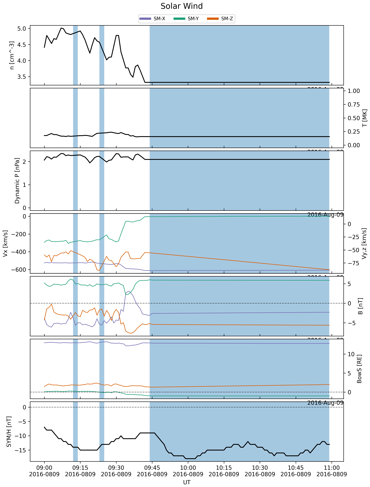
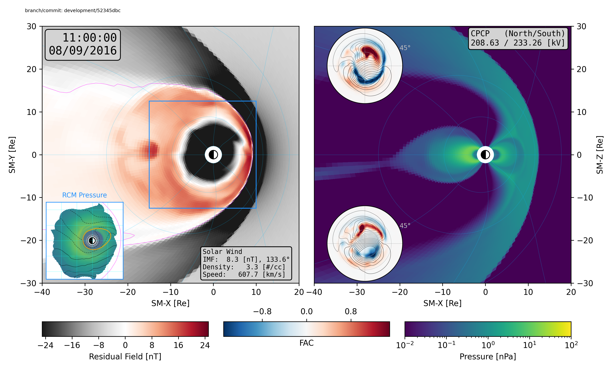

Geospace Quick Start
====================

These instructions illustrate the process of running a magnetosphere
simulation using the MAGE model in the ``kaiju`` code.

Before you begin
----------------

*Source* (not *run*) the environment setup scripts for the ``kaiju`` and
``kaipy`` software. For example:

.. code-block:: bash

    source /path/to/your/kaiju-clone/scripts/setupEnvironment.sh
    source /path/to/your/kaipy-clone/kaipy/scripts/setupEnvironment.sh

Running a magnetosphere simulation with MAGE
--------------------------------------------

The MAGE software needs several files in order to run. The detailed steps
for creating these files have been combined into a script called
``makeitso.py``. The script is provided in the ``kaiju`` code repository. More
information on ``makeitso.py`` is available
:doc:`here <../../userGuide/makeitso/makeitso>`.

You can see the options supported by ``makeitso.py`` by running it with the
``--help`` or ``-h`` command-line option.

.. code-block:: bash

    makeitso.py --help
    usage: makeitso.py [-h] [--clobber] [--debug] [--mode MODE] [--options_path OPTIONS_PATH] [--verbose]

    Interactive script to prepare a MAGE magnetosphere model run.

    optional arguments:
      -h, --help            show this help message and exit
      --clobber             Overwrite existing options file (default: False).
      --debug, -d           Print debugging output (default: False).
      --mode MODE           User mode (BASIC|INTERMEDIATE|EXPERT) (default: BASIC).
      --options_path OPTIONS_PATH, -o OPTIONS_PATH
                            Path to JSON file of options (default: None)
      --verbose, -v         Print verbose output (default: False).

For this example, we will run the code on ``derecho``, and use the default
``BASIC`` mode, which requires the minimum amount of input from the user. At
each prompt, you can either type in a value, or hit the :kbd:`Return` key to
accept the default value (shown in square brackets at the end of the prompt).
To get started, load the CDF library and run ``makeitso.py`` with no
arguments:

.. code-block:: bash

    source /path/to/your/cdf/bin/definitions.B
    $KAIJUHOME/scripts/makeitso/makeitso.py
    Name to use for PBS job(s) [geospace]:
    Do you have an existing boundary condition file to use? (Y|N) [N]:
    Start date for simulation (yyyy-mm-ddThh:mm:ss) [2016-08-09T09:00:00]:
    Stop date for simulation (yyyy-mm-ddThh:mm:ss) [2016-08-09T11:00:00]:
    Do you want to split your job into multiple segments? (Y|N) [N]:
    GAMERA grid type (D|Q|O|H) [Q]:
    Name of HPC system (derecho|pleiades) [pleiades]: derecho
    PBS account name [<YOUR_ACCOUNT_HERE>]:
    Run directory [.]:
    Path to kaiju installation [<YOUR_KAIJUHOME_HERE>]:
    Path to kaiju build directory [<YOUR_BUILD_DIRECTORY_HERE>]:

    PBS queue name (develop|main|preempt) [main]:
    Job priority (regular|economy) [economy]:
    WARNING: You are responsible for ensuring that the wall time is sufficient to run a segment of your simulation!
    Requested wall time for each PBS job segment (HH:MM:SS) [01:00:00]: 12:00:00
    (GAMERA) Relative path to HDF5 file containing solar wind boundary conditions [bcwind.h5]:
    (VOLTRON) File output cadence in simulated seconds [60.0]:

After these inputs, the script fetches data from CDAWeb for the specified time
range to use in the solar wind boundary condition file, and generates XML and
PBS files for the run, as well as a grid file for use in the model.

You should see output similar to this:

.. code-block:: bash

    Generating Quad LFM-style grid ...

    Output: lfmQ.h5
    Size: (96,96,128)
    Inner Radius: 2.000000
    Sunward Outer Radius: 30.000000
    Tail Outer Radius: 322.511578
    Low-lat BC: 45.000000
    Ring params:
    <ring gid="lfm" doRing="T" Nr="8" Nc1="8" Nc2="16" Nc3="32" Nc4="32" Nc5="64" Nc6="64" Nc7="64" Nc8="64"/>

    Writing to lfmQ.h5
    /glade/u/home/ewinter/miniconda3/envs/kaiju-3.8/lib/python3.8/site-packages/spacepy/time.py:2367: UserWarning: Leapseconds may be out of date. Use spacepy.toolbox.update(leapsecs=True)
    warnings.warn('Leapseconds may be out of date.'
    Retrieving f10.7 data from CDAWeb
    Retrieving solar wind data from CDAWeb
            Using Bx fields
    Bx Fit Coefficients are  [-3.78792744 -0.77915822 -1.0774984 ]
    Saving "OMNI_HRO_1MIN.txt_bxFit.png"
    Converting to Gamera solar wind file
            Found 21 variables and 120 lines
            Offsetting from LFM start ( 0.00 min) to Gamera start ( 0.00 min)
    Saving "OMNI_HRO_1MIN.txt.png"
    Writing Gamera solar wind to bcwind.h5
    Reading /glade/derecho/scratch/ewinter/cgs/aplkaiju/kaipy-private/development/kaipy-private/kaipy/rcm/dktable
    Reading /glade/derecho/scratch/ewinter/cgs/aplkaiju/kaipy-private/development/kaipy-private/kaipy/rcm/wmutils/chorus_polynomial.txt
    Dimension of parameters in Chorus wave model, Kp: 6 MLT: 97 L: 41 Ek: 155
    Wrote RCM configuration to rcmconfig.h5

    Template creation complete!

    The PBS scripts ['./geospace-00.pbs'] have been created, each with a corresponding XML file. To submit the jobs with the proper dependency (to ensure each segment runs in order), please run the script geospace_pbs.sh like this:
    bash geospace_pbs.sh

You should now see the following files in your run directory:

.. code-block:: bash

    ls
    bcwind.h5        geospace.json    OMNI_HRO_1MIN.txt_bxFit.png
    geospace-00.pbs  geospace_pbs.sh  OMNI_HRO_1MIN.txt.png
    geospace-00.xml  lfmQ.h5          rcmconfig.h5

The image files are summaries of the CDAWeb data used in the initial condition
file (``bcwind.h5``). Those plots should look like:

Finally, submit the model run using the script generated by ``makeitso.py``.
You will see the resulting PBS job ID.

.. code-block:: bash

    bash geospace_pbs.sh
    7808651.desched1

Once the job is started in the queue, it should take about 80 minutes to run
(on ``derecho``). When complete, you will see many new HDF5 files in your
run directory, along with PBS housekeeping files and logs. The most important
files are (repeated upper-case letters in the names represent integer
strings):

* ``geospace_LLLLL_MMMMM_NNNNN_IIIII_JJJJJ_KKKKK.gam.h5``

    These files contain the core MHD variables from the simulation, computed
    by the `GAMERA <https://cgs.jhuapl.edu/Models/gamera.php>`_ portion of the
    `MAGE <https://cgs.jhuapl.edu/Models>`_ model. The strings ``LLLLL``,
    ``MMMMM``, and ``NNNNN`` contain the number of subsections of the ``X``,
    ``Y``, and ``Z`` dimensions used to divide the domain among MPI ranks. The
    strings ``IIIII``, ``JJJJJ``, and ``KKKKK`` represent the MPI rank index
    along each dimension.

* ``geospace.mix.h5``

    This file contains the results from the
    `REMIX <https://cgs.jhuapl.edu/Models/remix.php>`_ portion of the
    `MAGE <https://cgs.jhuapl.edu/Models>`_ model.

* ``geospace.rcm.h5``

    This file contains the results from the
    `RCM <https://cgs.jhuapl.edu/Models/rcm.php>`_ portion of the
    `MAGE <https://cgs.jhuapl.edu/Models>`_ model.

* ``geospace_*.gam.Res.RRRRR.h5``

    These are checkpoint files generated during the simulation which can be
    used as restart points for future simulations.

Now perform a quick visualization of the results from your model using the
``msphpic.py`` script, provided in the ``kaipy`` package.

.. code-block:: bash

    msphpic.py -id geospace

This script will create a file called ``qkmsphpic.png``, which should look
like this:

