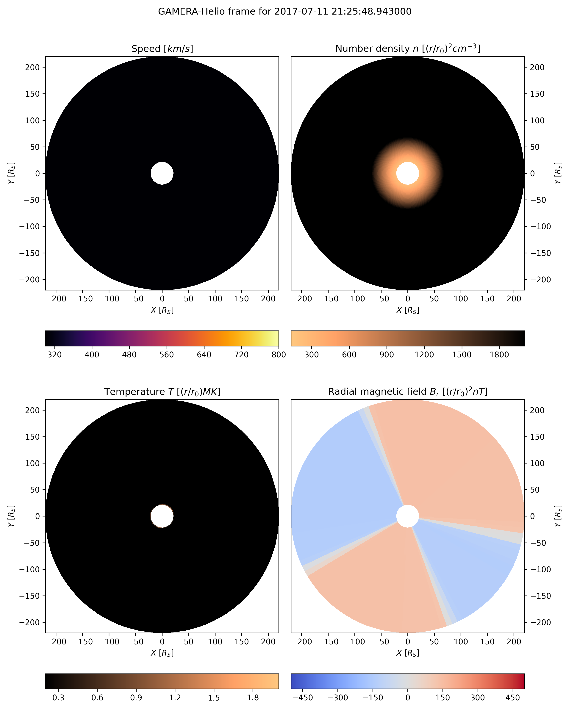

Heliosphere Quick Start
=======================

These instructions illustrate the process of running a simple heliosphere
model to test your build of the ``kaiju`` code.

Before you begin
----------------

*Source* (not *run*) the environment setup scripts for the ``kaiju`` and
``kaipy`` software. For example:

.. code-block:: bash

    source /path/to/your/kaiju-clone/scripts/setupEnvironment.sh
    source /path/to/your/kaipy-clone/kaipy/scripts/setupEnvironment.sh

Running a heliosphere simulation
--------------------------------

The ``gamhelio_mpi.x`` software needs several files in order to run. The
detailed steps for creating these files have been combined into a script
called ``makeitso-gamhelio.py``. The script is provided in the ``kaiju`` code
repository. More information on ``makeitso-gamhelio.py`` is available
:doc:`here <../../userGuide/makeitso/makeitso-gamhelio>`.

You can see the options supported my ``makeitso-gamhelio.py`` by
running it with the ``--help`` or ``-h`` command-line option.

.. code-block:: bash

   makeitso-gamhelio.py --help
   usage: makeitso-gamhelio.py [-h] [--clobber] [--debug] [--mode MODE] [--options_path OPTIONS_PATH] [--verbose]

   Script to prepare a GAMERA heliosphere run.

   optional arguments:
     -h, --help            show this help message and exit
     --clobber             Overwrite existing options file (default: False).
     --debug, -d           Print debugging output (default: False).
     --mode MODE           User mode (BASIC|INTERMEDIATE|EXPERT) (default: BASIC).
     --options_path OPTIONS_PATH, -o OPTIONS_PATH
                             Path to JSON file of options (default: None)
     --verbose, -v         Print verbose output (default: False).

For this example, we will run the code on ``derecho``, and use the default
``BASIC`` mode, which requires the minimum amount of input from the user. At
each prompt, you can either type in a value, or hit the :kbd:`Return` key to
accept the default value (shown in square brackets at the end of the prompt).

.. important:: The ``gamhelio_mpi.x`` software requires a FITS file containing
    the output from the WSA (Wang-Sheeley-Arge) solar wind model, covering the
    time period of interest. This file is called ``wsa.fits`` in the example
    below.
    
To get started, run ``makeitso-gamhelio.py`` with no arguments:

.. code-block:: bash

   makeitso-gamhelio.py

   Name to use for PBS job(s) [helio]: 
   Path to WSA boundary condition file to use [wsa.fits]: 
   Start date for simulation (yyyy-mm-ddThh:mm:ss) [2017-07-20T05:22:47]: 
   Stop date for simulation (yyyy-mm-ddThh:mm:ss) [2017-08-16T12:05:59]: 
   Do you want to split your job into multiple segments? (Y|y|N|n) [N]: 
   Name of HPC system (derecho|pleiades) [pleiades]: derecho
   PBS account name [<YOUR_ACCOUNT_HERE>]:
   Path to kaiju installation [<YOUR_KAIJUHOME_HERE>]:
   Path to kaiju build directory [<YOUR_BUILD_DIRECTORY_HERE>]:
   Run directory [.]: 
   PBS queue name (develop|main) [main]:
   Job priority (regular|economy) [economy]:
   WARNING: You are responsible for ensuring that the wall time is sufficient to run a segment of your simulation!
   Requested wall time for each PBS job segment (HH:MM:SS) [01:00:00]: 
   Number of radial grid cells [128]: 
   Number of polar angle grid cells [64]: 
   Number of azimuthal angle grid cells [128]: 

   Template creation complete!

After these inputs, the script reads data from the WSA FITS file, converts it
to a format readable by ``gamhelio_mpi.x`` and generates the XML input file.

You should now see the following files in your run directory:

.. code-block:: bash

   ls
   helio-00.pbs  helio-00.xml  heliogrid.h5  helio.json  helio_pbs.sh  innerbc.h5  wsa2gamera.ini  wsa2gamera.log  wsa.fits

Finally, submit the model run using the script generated by
``makeitso-gamhelio.py``. You will see the resulting PBS job ID.

.. code-block:: bash

    bash helio_pbs.sh
    8535866.desched1

Once the job is started in the queue, it should take about 15 minutes to run
(on ``derecho``). When complete, you will see many new HDF5 files in your
run directory, along with PBS housekeeping files and logs. The most important
files are (repeated upper-case letters in the names represent integer
strings):

* ``helio_LLLLL_MMMMM_NNNNN_IIIII_JJJJJ_KKKKK.gam.h5``

    These files contain the core MHD variables from the simulation, computed
    by the ``gamhelio_mpi.x`` portion of the ``kaiju`` software. The strings
    ``LLLLL``, ``MMMMM``, and ``NNNNN`` contain the number of subsections of
    the ``X``, ``Y``, and ``Z`` dimensions used to divide the domain among MPI
    ranks. The strings ``IIIII``, ``JJJJJ``, and ``KKKKK`` represent the MPI
    rank index along each dimension.

* ``helio_*.gam.Res.RRRRR.h5``

    These are checkpoint files generated during the simulation which can be
    used as restart points for future simulations.

Now perform a quick visualization of the results from your model using the
``heliopic.py`` script, provided in the ``kaipy`` package.

.. code-block:: bash

    heliopic.py -id helio

This script will create a file called ``qkpic_helio_pic1_n1.png``, which
should look like this:

