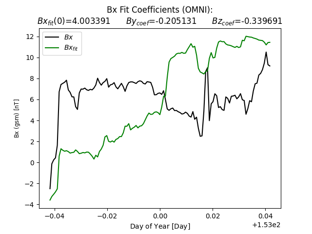
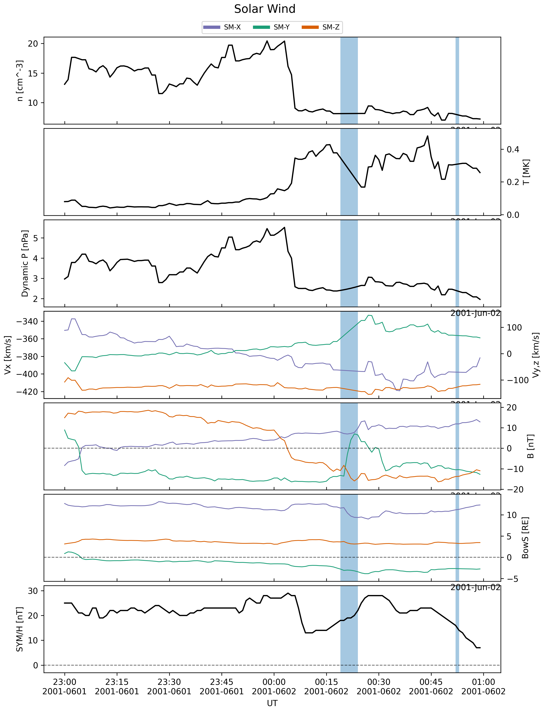

MAGE - With TIEGCM (GTR) Quick Start
===================================================

These instructions illustrate the process of running a geospace
simulation using the MAGE model coupled with TIEGCM. We call
this version of the model "GTR" ("GAMERA-TIEGCM-RAIJU") for brevity.

Before you begin
------------------------------------------------

*Source* (not *run*) the environment setup scripts for the ``kaiju`` software and add paths to ``TIEGCMHOME`` and ``TIEGCMDATA``.
For example:

.. code-block:: bash

    source /path/to/your/kaiju-clone/scripts/setupEnvironment.sh
    export TIEGCMHOME=/path/to/your/tiegcm
    export TIEGCMDATA=/path/to/your/tiegcm/data

.. note::

    The ``TIEGCMHOME`` and ``TIEGCMDATA`` environment variables are required
    for running the GTR model. They should point to the TIEGCM source code
    directory and the TIEGCM data directory, respectively.

    The TIEGCMDATA directory is located in the following locations:
        - On ``derecho``: ``/glade/campaign/hao/itmodel/tiegcm3.0/new_data``
        - On ``pleiades``: ``/nobackup/nrao3/tiegcm/tiegcm3.0/data``
        - The required data files can be downloaded from the NCAR Globus endpoint using the following link: `TIEGCM Data Files <https://app.globus.org/file-manager?origin_id=b2502c58-c3eb-470f-86d4-cbdcd0aeb6c8&origin_path=%2F>`_

Build guide for TIEGCM
************************************************
`TIEGCM <https://tiegcm-docs.readthedocs.io/>`_ is a comprehensive, first-principles, three-dimensional, 
non-linear representation of the coupled thermosphere and ionosphere system that includes a self-consistent solution 
of the middle and low-latitude dynamo field. 

Two TIEGCM executables are required for running the GTR model:

    - TIEGCM Standalone
        This is the TIEGCM code that runs independently and is used for initialization of the model.
    - TIEGCM Coupled
        This is the TIEGCM code that runs in a coupled mode with the GR model, providing 
        real-time updates to the thermosphere and ionosphere conditions during the simulation.

Depending on the Gamera resolution you will need to compile different TIEGCM resolution executables:
    - For a ``D`` run
        - TIEGCM Standalone: horires = 2.5, vertres = 0.25(1/4), mres = 2
        - TIEGCM Coupled: horires = 2.5, vertres = 0.25(1/4), mres = 2
    - For a ``Q`` run
        - TIEGCM Standalone: horires = 2.5, vertres = 0.25(1/4), mres = 2
        - TIEGCM Coupled: horires = 1.25, vertres = 0.125(1/8), mres = 1
    - For a ``O`` run
        - TIEGCM Standalone: horires = 1.25, vertres = 0.125(1/8), mres = 1
        - TIEGCM Coupled: horires = 0.625, vertres = 0.0625(1/16), mres = 0.5

The TIEGCM code is built using the ``tiegcmrun`` script, which is provided in
the ``tiegcm`` code repository. The script is provided in the
``tiegcm/tiegcmrun`` directory. More information on ``tiegcmrun.py`` can be found
in the `TIEGCM Quick Start Guide <https://tiegcm-docs.readthedocs.io/en/latest/tiegcm/quickstart.html>`_.

.. important::
    Make sure to load the modules lised in the ``kaiju`` build instructions
    before running the ``tiegcmrun`` script. (:doc:`Derecho </building/buildDerecho>` or :doc:`Pleiades </building/buildPleiades>`)

Lets take an example of building the TIEGCM code for a ``Q`` run on ``derecho``:
#########################################################################################

1. First we will create a directory for the TIEGCM build

.. code-block:: bash

    mkdir tiegcm_build
    cd tiegcm_build

2. Next, we will build the standalone TIEGCM executable by running the ``tiegcmrun.py`` script with the ``-oc``.

.. note::
    The ``-oc`` option stands for "only compile", which means that the script will only compile the code and not run it.
    Since the Gamera resolution is ``Q``, we will set the horizontal resolution for the standalone TIEGCM to 2.5 degrees,
    vertical resolution to 0.25 degrees, and the top altitude to 7.0 RE.

.. code-block:: bash

    $TIEGCMHOME/tiegcmrun/tiegcmrun.py -oc
    Instructions:
    -> Default Selected input parameter is given in GREEN
    -> Warnings and Information are given in YELLOW
    -> Errors are given in RED
    -> Valid values (if any) are given in brackets eg. (value1 | value2 | value3) 
    -> Enter '?' for any input parameter to get a detailed description

    Run Options:
    User Mode = BASIC
    Compile = True
    Execute = False
    Coupling = False

    Name of HPC system (derecho|pleiades|linux) [derecho]: 
    Standalone Executable [/glade/derecho/scratch/nikhilr/tiegcm_build/exec/tiegcm.exe]: 
    Horizontal Resolution (Deg) (5.0|2.5|1.25|0.625) [2.5]: 
    Vertical Resolution (Scale Height) (1/2|1/4|1/8|1/16) [1/4]: 
    Magnetic grid resolution (Degree) (2|1|0.5) [2]: 

After these inputs, the script will compile the TIEGCM code and create the standalone executable and should output something like this:

.. code-block:: bash

    ..
    .. 
    gmake[1]: Leaving directory '/glade/derecho/scratch/nikhilr/tiegcm_build/exec'    
    Executable copied from /glade/derecho/scratch/nikhilr/tiegcm_build/exec/tiegcm.exe to /glade/derecho/scratch/nikhilr/tiegcm_build/stdout

3. Next, we will build the coupled TIEGCM executable by running the ``tiegcmrun.py`` script with the ``-oc`` and ``-co`` options.

.. note::
    The ``-co`` option stands for "coupled", which means that the script will compile the code for the coupled TIEGCM executable.
    Since the Gamera resolution is ``Q``, we will set the horizontal resolution for the coupled TIEGCM to 1.25 degrees,
    vertical resolution to 0.125 degree.

.. code-block:: bash

    $TIEGCMHOME/tiegcmrun/tiegcmrun.py -oc -co
    Instructions:
    -> Default Selected input parameter is given in GREEN
    -> Warnings and Information are given in YELLOW
    -> Errors are given in RED
    -> Valid values (if any) are given in brackets eg. (value1 | value2 | value3) 
    -> Enter '?' for any input parameter to get a detailed description

    Run Options:
    User Mode = BASIC
    Compile = True
    Execute = False
    Coupling = True

    Name of HPC system (derecho|pleiades|linux) [derecho]: 
    Coupled Executable [/glade/derecho/scratch/nikhilr/tiegcm_build/exec/tiegcm.x]: 
    Horizontal Resolution (Deg) (5.0|2.5|1.25|0.625) [2.5]: 1.25
    Vertical Resolution (Scale Height) (1/2|1/4|1/8|1/16) [1/8]: 
    Magnetic grid resolution (Degree) (2|1|0.5) [1]: 

After these inputs, the script will compile the TIEGCM code and create the coupled executable and should output something like this:

.. code-block:: bash

    ..
    ..
    gmake[1]: Leaving directory '/glade/derecho/scratch/nikhilr/tiegcm_build/exec'    
    Executable copied from /glade/derecho/scratch/nikhilr/tiegcm_build/exec/tiegcm.x to /glade/derecho/scratch/nikhilr/tiegcm_build/stdout

4. You should now see the following files in your run directory:

.. code-block:: bash

    ls
    exec  hist  stdout

The executables are located in the ``stdout`` directory, and the stdout files

.. code-block:: bash

    ls stdout
    defs.h  tiegcm.exe  tiegcm.x

Running a geospace simulation with MAGE
--------------------------------------------
The MAGE software needs several files in order to run. The detailed steps
for creating these files have been combined into a script called
``engage.py``. The script is provided in the ``kaiju`` code repository. More
information on ``engage.py`` is available
:doc:`here </makeitso/engage>`.

You can see the options supported by ``engage.py`` by running it with the
``--help`` or ``-h`` command-line option.

.. code-block:: bash

    engage.py --help
    usage: engage.py [-h] [--clobber] [--debug] [--mode MODE] [--engage_options_path ENGAGE_OPTIONS_PATH] [--makeitso_options_path MAKEITSO_OPTIONS_PATH] [--tiegcm_options_path TIEGCM_OPTIONS_PATH] [--verbose]

    Interactive script to prepare a MAGE geospace model run.

    options:
    -h, --help            show this help message and exit
    --clobber             Overwrite existing options file (default: False).
    --debug, -d           Print debugging output (default: False).
    --mode MODE           User mode (BASIC|INTERMEDIATE|EXPERT) (default: BASIC).
    --engage_options_path ENGAGE_OPTIONS_PATH, -eo ENGAGE_OPTIONS_PATH
                            Path to engage JSON file of options (default: None)
    --makeitso_options_path MAKEITSO_OPTIONS_PATH, -mo MAKEITSO_OPTIONS_PATH
                            Path to makeitso JSON file of options (default: None)
    --tiegcm_options_path TIEGCM_OPTIONS_PATH, -to TIEGCM_OPTIONS_PATH
                            Path to tiegcm JSON file of options (default: None)
    --verbose, -v         Print verbose output (default: False).

For this example, we will run the code on ``derecho``, and use the default
``BASIC`` mode, which requires the minimum amount of input from the user. At
each prompt, you can either type in a value, or hit the :kbd:`Return` key to
accept the default value (shown in square brackets at the end of the prompt).

Copy the executables you built in the previous steps to your run directory.

.. code-block:: bash

    cp tiegcm_build/stdout/tiegcm.exe .
    cp tiegcm_build/stdouttiegcm.x .
    cp $KAIJUHOME/build_mpi/bin/voltron_mpi.x .

To get started, run ``engage.py`` with no arguments:

.. code-block:: bash

    $KAIJUHOME/scripts/makeitso/engage.py 
    
    tiegcmrum from /glade/u/home/nikhilr/kaiju_engage/tiegcm/tiegcmrun/tiegcmrun.py
    makeitso from /glade/u/home/nikhilr/kaiju_engage/kaiju-private/scripts/makeitso/makeitso.py
    
    Name to use for PBS job(s) [geospace]: 
    Start date for simulation (yyyy-mm-ddThh:mm:ss) [2001-06-01T23:00:00]:
    Stop date for simulation (yyyy-mm-ddThh:mm:ss) [2001-06-02T01:00:00]:
    Do you want to split your job into multiple segments? (Y|N) [Y]: 
    Segment length in simulated seconds [7200.0]: 3600
    GAMERA grid type (D|Q|O|H) [Q]: 
    Name of HPC system (derecho|pleiades) [pleiades]: derecho
    PBS account name [<YOUR_ACCOUNT_HERE>]: 
    Run directory [.]: 
    Path to kaiju installation [<YOUR_KAIJUHOME_HERE>]: 
    Path to kaiju build directory [<YOUR_BUILD_DIRECTORY_HERE>]: 
    PBS queue name (develop|main) [main]: 
    Job priority (regular|economy) [economy]: 
    WARNING: You are responsible for ensuring that the wall time is sufficient to run a segment of your simulation!
    Requested wall time for each PBS job segment (HH:MM:SS) [01:00:00]: 12:00:00
    Root directory for the simulation [<YOUR_RUN_DIRECTORY_HERE>]: 
    Conda environment to use for the simulation [<YOUR_CONDA_ENVIRONMENT_DIRECTORY_HERE>]: 

.. warning::

    Make sure to set ``Path to kaiju build directory`` to the directory where you built the
    ``voltron_mpi.x`` executable with the module set for GTR runs. If you followed the build
    instructions, this should be the ``build_gtr`` subdirectory. This is required for running
    the model in GTR mode.

``engage.py`` will then prompt you for the following additional information from ``makeitso``:

.. code-block:: bash

    Extend TFIN by dtCouple - 1 seconds (T|F) [T]: 
    (VOLTRON) Run in GCM mode (T|F) [T]: 
    Do you have an existing boundary condition file to use? (Y|N) [N]: 
    (GAMERA) Relative path to HDF5 file containing solar wind boundary conditions [bcwind.h5]: 
    (VOLTRON) File output cadence in simulated seconds [60.0]: 

After these inputs, the script fetches data from CDAWeb for the specified time
range to use in the solar wind boundary condition file.

You should see output similar to this:

.. code-block:: bash

    GGenerating Quad LFM-style grid ...

    Output: lfmQ.h5
    Size: (96,96,128)
    Inner Radius: 2.000000
    Sunward Outer Radius: 30.000000
    Tail Outer Radius: 322.511578
    Low-lat BC: 45.000000
    Ring params: 
    <ring gid="lfm" doRing="T" Nr="8" Nc1="8" Nc2="16" Nc3="32" Nc4="32" Nc5="64" Nc6="64" Nc7="64" Nc8="64"/>

    Writing to lfmQ.h5
    14-Jun-25 19:30:03: /glade/work/nikhilr/conda-envs/kaiju-3.12/lib/python3.12/site-packages/spacepy/time.py:2448: UserWarning: Leapseconds may be out of date. Use spacepy.toolbox.update(leapsecs=True)
    _read_leaps()

    Retrieving f10.7 data from CDAWeb
    Retrieving solar wind data from CDAWeb
            Using Bx fields
    Bx Fit Coefficients are  [-3.78792744 -0.77915822 -1.0774984 ]
    Saving "OMNI_HRO_1MIN.txt_bxFit.png"
    Converting to Gamera solar wind file
            Found 21 variables and 120 lines
            Offsetting from LFM start ( 0.00 min) to Gamera start ( 0.00 min)
    Saving "OMNI_HRO_1MIN.txt.png"
    Writing Gamera solar wind to bcwind.h5
    Making new raijuconfig.h5, destroying pre-existing file if there
    Stamping file with git hash and branch, and script args
    Adding waveModel to raijuconfig.h5
    Reading /glade/derecho/scratch/ewinter/cgs/aplkaiju/kaipy-private/dev_312/kaipy-private/kaipy/raiju/waveModel/chorus_polynomial.txt
    Adding Species to raijuconfig.h5
    Adding params used to generate lambda distribution as root attribute

    Template creation complete!

    The PBS scripts ['./geospace-SPINUP.pbs', './geospace-WARMUP-01.pbs', './geospace-WARMUP-02.pbs', './geospace-01.pbs'] have been created, each with a corresponding XML file. To submit the jobs with the proper dependency (to ensure each segment runs in order), please run the script geospace_pbs.sh like this:
    bash geospace_pbs.sh

``engage.py`` will then prompt you for the following additional information from ``tiegcmrun``:

.. code-block:: bash

    Instructions:
    -> Default Selected input parameter is given in GREEN
    -> Warnings and Information are given in YELLOW
    -> Errors are given in RED
    -> Valid values (if any) are given in brackets eg. (value1 | value2 | value3) 
    -> Enter '?' for any input parameter to get a detailed description

    Run Options:
    User Mode = BASIC
    Compile = False
    Execute = False
    Coupling = True
    Engage = True

    Directory of model [<YOUR_TIEGCMHOME_HERE>]: 
    Directory of Tiegcm Data Files [<YOUR_TIEGCMDATA_HERE>]: 
    Standalone Executable [<YOUR_TIEGCM_STANDALONE_EXECUTABLE_HERE>]: 
    Coupled Executable [<YOUR_TIEGCM_COUPLED_EXECUTABLE_HERE>]: 
    Low = 70, Medium = 140 , High = 200
    F107 flux level for TIEGCM spin up (low|medium|high) [low]: 
    SOURCE file location [/glade/campaign/hao/itmodel/tiegcm3.0/new_data/source/junsol_f70.nc]: 
    If the SOURCE_START history is not found on the SOURCE file, the model will print an error message and stop.
    Selected date in source file Example: (173,0,0,0) [173 0 0 0]: 
    STEP number [30]: 
    NSTEP_SUB number [10]: 
    Secondary Output Fields [['TN', 'UN', 'VN', 'NE', 'TEC', 'POTEN', 'Z', 'ZG']] / ENTER to go next: 
    High-latitude potential model that is going to be used (HEELIS|WEIMER) [HEELIS]: 
    If GPI_NCFILE is specified, then KP and POWER/CTPOTEN are skipped. If further POTENTIAL_MODEL is WEIMER and IMF_NCFILE is specified, then the Weimer model and aurora will be driven by the IMF data, and only F107 and F107A will be read from the GPI data file.
    GPI file [/glade/campaign/hao/itmodel/tiegcm3.0/new_data/boundary_files/GPI/gpi_1960001-2024332.nc]: 

After these inputs, the script interpolates source file for TIEGCM, and generates XML and
PBS files for the run, as well as a grid file for use in the model.

You should see output similar to this:

.. code-block:: bash

    /glade/derecho/scratch/nikhilr/GTR58 exitsts
    /glade/derecho/scratch/nikhilr/GTR58 exitsts
    /glade/derecho/scratch/nikhilr/GTR58 exitsts
    Interpolating primary file /glade/campaign/hao/itmodel/tiegcm3.0/new_data/source/junsol_f70.nc to create new primary file /glade/derecho/scratch/nikhilr/GTR58/tiegcm_standalone/geospace-tiegcm-standalone_prim.nc at horizontal resolution 2.5 and vertical resolution 0.25 with zitop 7.0.
    Creating new primary file:  /glade/derecho/scratch/nikhilr/GTR58/tiegcm_standalone/geospace-tiegcm-standalone_prim.nc
    pbs_scripts = ['./geospace-01.pbs', './geospace-02.pbs']
    submit_all_jobs_script = geospace_pbs.sh

You should now see the following files in your run directory:

.. code-block:: bash

    ls
    bcwind.h5               geospace-SPINUP.pbs     lfmQ.h5
    engage_parameters.json  geospace-SPINUP.xml     makeitso_parameters.json
    geospace-01.inp         geospace-WARMUP-01.pbs  OMNI_HRO_1MIN.txt_bxFit.png
    geospace-01.pbs         geospace-WARMUP-01.xml  OMNI_HRO_1MIN.txt.png
    geospace-01.xml         geospace-WARMUP-02.pbs  raijuconfig.h5
    geospace-02.inp         geospace-WARMUP-02.xml  tiegcm.exe
    geospace-02.pbs         geospace-WARMUP-03.pbs  tiegcmrun_parameters.json
    geospace-02.xml         geospace-WARMUP-03.xml  tiegcm_standalone
    geospace.json           geospace-WARMUP-04.pbs  tiegcm.x
    geospace_pbs.sh         geospace-WARMUP-04.xml  voltron_mpi.x

There are several types files created for each of the jobs, including:

* ``*.pbs``
    These are the PBS scripts that will be submitted to the job scheduler to run
    the segments of the simulation.
* ``*.xml``
    These are the XML files that contain the parameters for GAMERA and RAIJU of the
    segment. 
* ``*.inp``
    These are the namelist files that contain parameters for TIEGCM of the segment.
* ``*.json``
    These are the JSON files that contain the parameters for the simulation. They
    are generated by the ``engage.py`` script with all the parameters required to run the
    simulation.

The run is divided into segments:

* ``geospace-SPINUP.*``
    This segment runs the GAMERA model to create the initial conditions for the
    simulation. It is run first, and its output is used by the next segment.
* ``geospace-WARMUP-**.*``
    These segments runs the GAMERA RAIJU model to "warm up" for for the coupled model execution.
    The ``-01``, ``-02``, etc. suffixes indicate the segment number, and the
    segments are run in order.
* ``tiegcm_standalone-**.*``
    This segment runs the TIEGCM model to create the initial conditions for the coupled model.
    The ``-01`` to ``-08``. suffixes indicate the segment number, and the
    segments are run in order.
* ``geospace-**.*``
    These segments runs the GTR coupled modele. The ``-01``, ``-02``, etc. 
    suffixes indicate the segment number, and the segments are run
    in order.

This image shows how the segments are run in order:

.. image:: GTRSegment.png

The image files are summaries of the CDAWeb data used in the initial condition
file (``bcwind.h5``). Those plots should look similar to this:

Finally, submit the model run using the script generated by ``engage.py``.
You will see the resulting PBS job ID (your job ID will differ from what is
shown below).

.. code-block:: bash

    bash geospace_pbs.sh
    9770226.desched1
    9770227.desched1
    9770228.desched1
    9770229.desched1
    9770230.desched1
    9770231.desched1
    9770232.desched1
    9770233.desched1
    9770234.desched1
    9770235.desched1
    9770236.desched1
    9770237.desched1
    9770238.desched1
    9770239.desched1
    9770240.desched1

Once the job is started in the queue, it should take about 80 minutes to run
(on ``derecho``). When complete, you will see many new HDF5 files in your
run directory, along with PBS housekeeping files and logs. The most important
files are (repeated upper-case letters in the names represent integer
strings):

* ``geospace_LLLLL_MMMMM_NNNNN_IIIII_JJJJJ_KKKKK.gam.h5``

    These files contain the core MHD variables from the simulation, computed
    by the GAMERA portion of the MAGE model. The strings ``LLLLL``, ``MMMMM``,
    and ``NNNNN`` contain the number of subsections of the ``X``, ``Y``, and
    ``Z`` dimensions used to divide the domain among MPI ranks. The strings
    ``IIIII``, ``JJJJJ``, and ``KKKKK`` represent the MPI rank index along
    each dimension.

* ``geospace.mix.h5``

    This file contains the results from the
    `REMIX <https://cgs.jhuapl.edu/Models/remix.php>`_ portion of the
    `MAGE <https://cgs.jhuapl.edu/Models>`_ model.

* ``geospace.raiju.h5``

    This file contains the results from the
    RAIJU portion of the `MAGE <https://cgs.jhuapl.edu/Models>`_ model.

* ``geospace_sech_*.nc``

    These are secondary output files that contain the results from the 
    `TIEGCM <https://tiegcm-docs.readthedocs.io/>`_ portion of the
    `MAGE <https://cgs.jhuapl.edu/Models>`_ model.

* ``geospace_*.gam.Res.RRRRR.h5``

    These are checkpoint files generated during the simulation which can be
    used as restart points for future simulations.

* ``geospace_prim_*.nc``

    These are the primary output files from the TIEGCM portion of the model
    that are designed as checkpoint files.

* ``geospace_temp_*.nc``

    These are temporary output files from the TIEGCM portion of the model
    
Visualizing the results
-----------------------

Now perform a quick visualization of the results from your model using the
``msphpic.py`` script, provided in the ``kaipy`` package.

.. code-block:: bash

    msphpic.py -id geospace

This script will create a file called ``qkmsphpic.png``, which should look
similar to this:

.. image:: qkmsphpic.png
